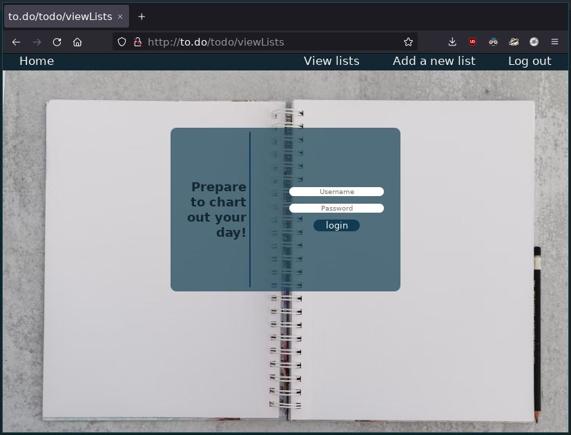

# Build-your-own-framework: Todo

**This project has been abandoned**

A showcase of a particularly involved school exercise/assignment I have been working on. 
This is a still a work in progress, and can hardly be called fully featured. It serves
mostly to display my newly acquired experience with Object-Oriented programming in PHP.

## Assignment: 

> Create a to-do tracking website, using the front/backend framework strategies you have
learned so far.

Requirements:

- Adding todos (done)
- Marking todos as 'done' (in progress)
- Editing todos (in progress)
- Ordering todos 
- Todos have to be stored in a database (done)
- User specific todos (i.e. a login system) (in progress)

The goal of the assignment is to familiarise oneself somewhat with the inner workings of a
web development framework, so that the underlying systems won't seem as alien. This also
builds an appreciation for how much of the heavy lifting isn't done by the developer. 

This project is hosted locally only, under an apache virtual host.
The project contains an .htaccess file, with the following URL rewriting rules:

    RewriteEngine on  
    RewriteCond %{REQUEST_FILENAME} !-f    
    RewriteRule ^(.*)$ src/index.php?url=$1 [NC,L,QSA]    
    RewriteRule ^([a-z]*)$ src/index.php [NC,L,QSA]  

Which serves the purpose of redirecting _every_ request back to `src/index.php` and pass
the url entered by the user as a `$_GET` variable. The index.php file spawns a router,
which will analyse the url and spawn the requisite controllers and call the proper methods
for every page.

Every page has an associated controller, with supportive services. Each controller has
methods, corresponding with the http request made. I.E. a `GET` request to home/index will
load the `HomeController.php` and call its `GETIndex()` method, whereas a `POST` request
to todo/createTodo will call `controllers\TodoController->POSTCreateTodo`, which will
handle the form input. 

Database management is handled through the `redbeanphp` ORM, template rendering is done
with `Twig`. Styling is done through `sass`.

### Screenshot of the site

### Dependencies for this project: 

`composer install`  
gabordemooij/redbean        
twig/twig         

`npm install`  
sass@1.50.1  

To tell `sass` to watch `.scss` files for changes and recompile in real time, execute `npm run
sass` in a terminal while inside this directory. 

